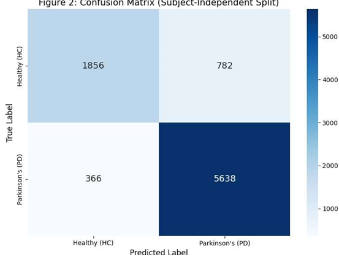

# MMA-NET: Dual Transformer Fusion with Cross-Modal Attention for Early Parkinson Detection

## 📌 Overview
Parkinson’s disease is a progressive neurological disorder that requires early diagnosis for effective treatment.  

This project proposes **MMA-NET**, a deep learning framework that integrates **Dual Transformer Fusion** with a **Cross-Modal Attention Mechanism** for robust early detection using multimodal data (voice + gait).

The model captures complex relationships between heterogeneous data sources to improve diagnostic accuracy.

---

## 🚀 Key Features
- Dual Transformer architecture for multimodal learning  
- Cross-modal attention for dynamic feature fusion  
- Voice + Gait data integration  
- Subject-independent evaluation (avoids data leakage)  
- High sensitivity for medical screening  

---

## 🧠 Architecture
The MMA-NET framework consists of:

1. Multimodal Feature Extraction  
2. Dual Transformer Encoders  
3. Cross-Modal Attention Fusion  
4. Classification Layer  

This design enables the model to capture temporal and cross-modal relationships effectively.

---

## 🛠️ Technologies Used
- Python  
- PyTorch  
- NumPy  
- Pandas  
- Scikit-learn  
- Transformers  

---

## 📊 Results

The model was evaluated using a **strict subject-independent split** to ensure real-world generalization.

### 🔹 Performance Metrics:
- **Accuracy:** 86.72%  
- **Recall (PD):** 94.0%  
- **F1 Score:** 91.0%  
- **AUC:** 0.92  

### 📈 Confusion Matrix

👉 The model achieves **high sensitivity**, making it suitable for early-stage screening of Parkinson’s disease.

---
## 📂 Project Structure

## 📄 Research Contribution
This work was presented at:

- **CML International Conference**
- **Institutional R&D Showcase**

---

## ⚠️ Note
- Dataset is not included due to size constraints  
- Model weights (.pth) are excluded  
- The project supports easy dataset integration  

---

## 🔮 Future Improvements
- Larger multimodal datasets  
- Real-time clinical deployment  
- Integration with wearable sensor data  
- Edge AI implementation  

---

## 👨‍💻 Author
**Kasa Delhi Babu**  

GitHub: https://github.com/Delhi0212

## 📂 Project Structure
